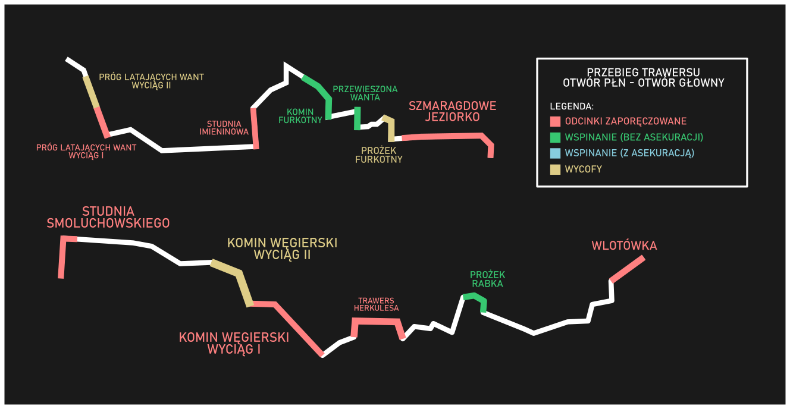

# Czarna 24h

Celem akcji było przejście trawersu czarnej (od otworu głównego do północnego, i z powrotem) jak najwięcej razy w czasie 24 godzin. Ostatetcznie zrobiliśmy 10 trawersów i zajęło nam to 23 godziny i 20 minut.

 

Start akcji: 04.03, godzina 11:20

Koniec: 05.05, godzina 10:40 

Uczestnicy: Kamila Wachnicka, Bartosz Ziarkowski

 

Czasy poszczgólnych etapów (g - otwór główny, p - otwór północny):

Trawers 1 (g-p): 11:20 - 14:06 [2h46min]

Trawers 2 (p-g): 14:06 - 16:02 [1h56min]

Trawers 3 (g-p): 16:02 - 18:00 [1h58min]

Trawers 4 (p-g) 18:00 - 20:01 [2h1min]

Trawers 5 (g-p) 20:01 - 22:03 [2h2min]

Trawers 6 (p-g) 22:03 - 0:15 [2h12min]

Trawers 7 (g-p) 0:15 - 2:27 [2h12min]

Trawers 8 (p-g) 2:27 - 4:49 [2h22min]

Trawers 9 (g-p) 4:49 - 7:00 [2h11min]

Trawers 10 (p-g) 7:00 - 10:40 [3h40min]

<figure>
 

<figcaption align = "center"><b>Przed i po akcji</b></figcaption>
</figure>
 

2 dni przed akcją, 2.03 zostawiliśmy w jaskini depozyt linowy i żywieniowy.

 

Przebieg akcji

 

 

