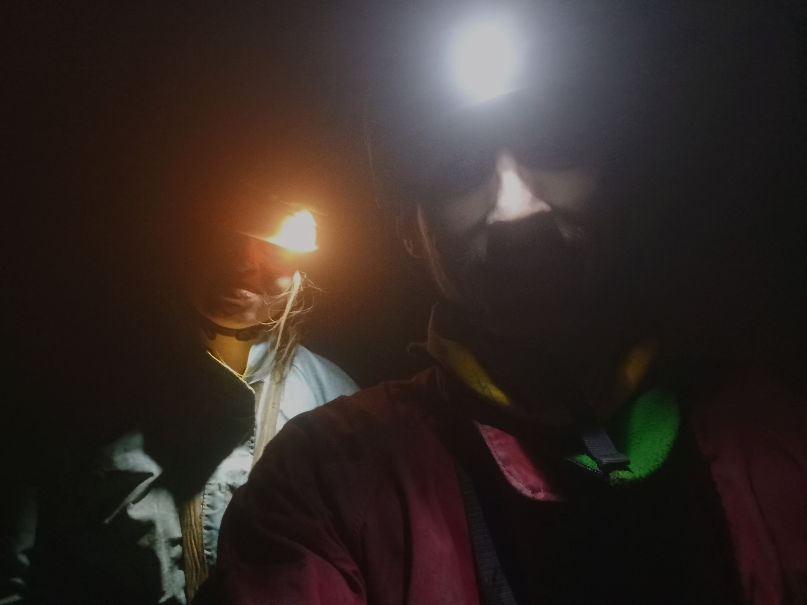

Przejście trawersu Czarnej 4 razy w ciągu.

Data: 12.01.2024

Uczestnicy: Kamila Wachnicka, Bartosz Ziarkowski

Czasy poszczególnych etapów:

---

Start z bazy: 9:37

Trawers I (główny-północny): 12:30-15:40 (3h10min)

Trawers II (północny-główny): 15:45-18:35 (2h50min)

Trawers III (główny-północny + przerwa na kawę):  18:45-21:30 (2h45min)

Trawers IV (północny-główny): 21:30-1:10 (3h40min)

Powrót na bazę: 3:23

---

Czasy ogólne

W jaskini: 12:30-1:10 (12h40min)

Od bazy do bazy: 9:37-3:23 (17h46min)

---

W jaskini poręczowaliśmy Wlotówkę, Studnię Smoluchowskiego, Szmaragdowe Jeziorko i Studnię Imieninową. Reszta wspinaczkowo.

Komin Węgierski wspinaliśmy obejściem. 

Wszystko z użyciem tzw technik lekkich (liny 7mm, 7.5mm)

---

Sprzęt

- BD Rope Dry 7.0mm (30m, 30m)

- Simond Rando Dry 7.5mm (30m, 30m, 30m, 40m)

- mieszanka karabinków Ocun Kestrel, Camp Nano i BD Litewire (20 sztuk)

- 5 ekspresów

- 2 worki

- 

**

 

Na podejściu dobre warunki, lekkie zachmurzenie. Od Pisanej pod otwór ścieżka nieprzetarta, ale ilość śniegu mała.

<figure>

<figcaption align = "center"><b>Na podejściu </b></figcaption>
</figure>
 

Po niecałych dwóch godzinach od wyjścia z bazy jesteśmy pod otworem. Godzina na przygotowanie sprzętu oraz przebranie i o 12:30 zaczynamy poręczować Wlotówkę, oczywiście wylodzoną. 

W Sali Hanki i Ewy zostawiamy gotowanie, aeropress i ruszamy dalej. Prożek Rabka, tutaj patent z ząbkiem na podchwyt z lewej znacząco ułatwia. Na trawersie Herkulesa wychodzimy do góry do stanowiska i zjeżdżamy. Komin Węgierski decydujemy przejść obejściem. Jest ono moim zdaniem łatwiejsze niż domyślny wariant. Ze względu na zbyt krótką linę końcówkę pierwszego wyciągu przechodzimy na lotnej.

Nie śpieszymy się zbytnio, bo z założenia pierwsze przejście ma być tylko rozgrzewką i przygotowaniem jaskini pod następne. Mamy kilka odcinków lin do zostawienia po drodze do otworu północnego. 

Dochodzimy do Studni Smoluchowskiego i tam zaczynamy poręczowanie.

<figure>

<figcaption align = "center"><b>Zjazd Smoluchem</b></figcaption>
</figure>
 

Następnie Szmaragdowe Jeziorko, tutaj też zostawiamy sznurek. Po Szmaragdzie seria 3 prożków, które przechodzimy sprawnie bez liny, zjazd Ślimakiem i dochodzimy nad Studnie Imieninową. Kolejny zjazd, który poręczujemy pod następne przejścia trawersu.

<figure>

<figcaption align = "center"><b>Widoki na powierzchni</b></figcaption>
</figure>
 

<figure>

<figcaption align = "center"><b>Zdjęcie pamiątkowe 1/4</b></figcaption>
</figure>
 

Powrót do otworu głównego mija w miarę sprawnie. Trochę przeszkadzają jedynie zbyt krótkie liny (2x30m) i wycofy na Progu Latających Want i Kominie Węgierskim musimy robić na 3 razy. Przynajmniej na przyszłość wiemy, żeby zabrać 2x40m.

Po drodze zbieramy wodę ze Szmaragdowego Jeziorka - przyda się później na kawę. Na powierzchni meldujemy się o 18:35. Połowa zrobiona.

<figure>

<figcaption align = "center"><b>Wychodzenie Wlotówki</b></figcaption>
</figure>
 

<figure>

<figcaption align = "center"><b>Zdjęcie pamiątkowe 2/4</b></figcaption>
</figure>
 

Trzeci trawers zaczynamy od kawy w Sali Hanki i Ewy. Opłacało się zabrać aeropress i trochę dobrej kawy. Kilka łyków czarnego wywaru poprawia i tak dobre już nastroje. Motywuje też do szybkiego poruszania się. 

Trzeci trawers przechodzimy najszybciej ze wszystkich. Odliczając przerwę na kawę, wychodzi 2h10min. Pomaga na pewno wcześniejsze rozchodzenie po jaskini i znajomość patentów na odcinkach wspinaczkowych. O 21:30 wychodzimy po raz drugi tego dnia otworem północnym i właściwie natychmiastowo wracamy pod ziemię na ostatni pasaż.

<figure>

<figcaption align = "center"><b>Zdjęcie pamiątkowe 3/4</b></figcaption>
</figure>
 

Czwarty trawers zajmuje najwięcej czasu. Na początku lina klinuje się przy zjeździe Latającymi Wantami. Trzeba podejść i ją odhaczyć. 

Najwięcej czasu tracimy jednak na Szmaragdzie. Trawers reporęczuje bez większych problemów i decyduję się zjechać na złodzieja ostatnią część. Po zdjęciu ostatniej przepinki udaje mi się wpaść do jeziorka, potem nie mogę zdjąć złodzieja, muszę podchodzić na dwóch przyrządach do stanowiska, żeby odzyskać linę. Na to tracimy minimum 20 minut.

Potem na szczęście już nic niespodziewanego się nie dzieje i o 1:10 oboje jesteśmy na powierzchni. Po 12 godzinach i 40 minutach akcję możemy uznać za udaną.

<figure>

<figcaption align = "center"><b>Zdjęcie pamiątkowe 4/4</b></figcaption>
</figure>
 

Na powierzchni zimno i wietrznie. Motywuje to do szybkiego przebrania się i schodzenia. Na bazę u Galicy wracamy około 3:23. Jakieś jedzenie, kąpiel i do spania...

*Czarna 24h wydaje się być pomysłem możliwym do zrealizowania.*

                                                                                                                          Bartosz Ziarkowski

<figure>

<figcaption align = "center"><b>Sceneria na powrocie</b></figcaption>
</figure>
 

