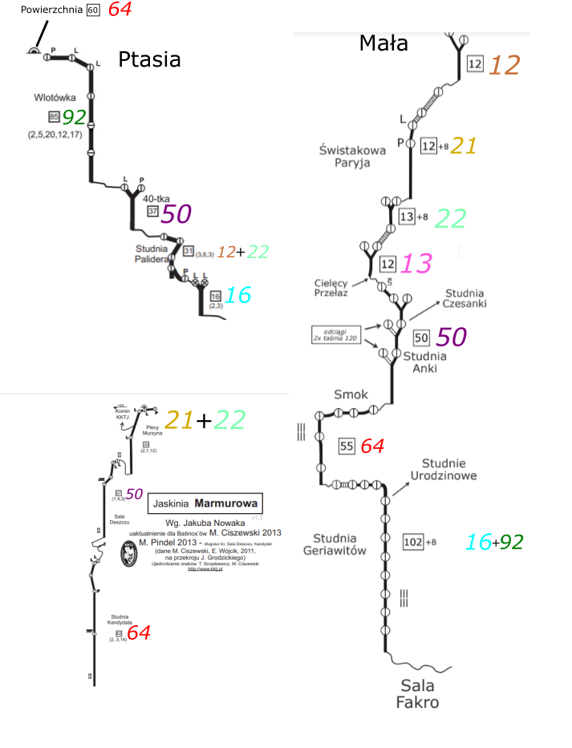
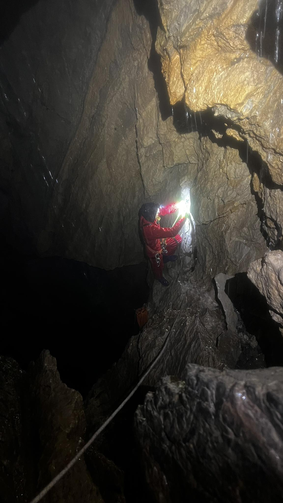

# [MUŁ] Mułowa Łańcuchówka

<cite>"[...] to było powyżej granicy szaleństwa..."</cite>

<cite>-- po wyjściu z Marmurowej</cite>

---

Pomysł na tą akcję powstał dosyć spontanicznie, ale takie są często najlepsze.
Trzy jaskinie: Ptasia Studnia, Mała w Mułowej i Marmurowa.
W ciągu, z poręczowaniem, bez depozytów. Styl "od bazy do bazy". Cel w każdej jaskini szczególny, zachęcający do jej odwiedzenia: Sala Dantego, Fakro i Piaskownica.
480m deniwelacji, licząc powierzchniowy zjazd do Ptasiej 540.
Po wstępnym spojrzeniu na szkice i spisaniu najbardziej optymalnych odcinków linowych wyszło około 300m. Do tego 29 karabinków.
Ilość sprzętu duża, ale przy odpowiednim sprężu możliwa do wniesienia przez 2 osoby.
Rozpiska wyglądała tak:

Pozostało tylko znaleźć wspołzawodnika/zawodniczkę dla tego przedsięwziecia i można działać. Na szczęście Ewa nie wymagała dużo przekonywania.
Prognozy na weekend nie najlepsze, dlatego decydujemy się na wyjście w niedzielę. Wtedy ma być trochę spokojniej niż w sobotę. Niestety tylko trochę.
Z bazy z charakterystycznym krakoskim sprężem wychodzimy niewiele przed 10. Podejście dosyć żwawym tempem. Po 2.5h jesteśmy pod otworem Małej. Tam przebieramy się, ogarniamy sprzęt i kierujemy się w kierunku Ptasiej.
Deszcz towarzyszy nam właściwie od rana, raz pada mocniej, raz słabiej ale wilgoć utrzymuje się cały czas na wysokim poziomie, ale wciąż w granicy rozsądku.
Niestety tego samego nie można powiedzieć o ilości wody w jaskini. W Ptasiej zmusza ona do naprawdę szybkiego poręczowania.

Strugi wody w studni Palidera

Po niecałych 40 minutach lądujemy w Sali Dantego. Spędzamy tam około pół minuty i kierujemy się do góry.
Wyjście do góry też nie zajmuje dużo czasu, główną trudnością we Wlotówce jest niezachłyśnięcie się spływającą z góry wodą.
Pomaga zasada: <i>Nie patrzeć do góry, tylko skupić się na ruchu płanietą.</i>
Po wyciągnięciu lin do góry czuć, że już w tym momencie napuchły od wody i zwiększyły swoją masę dwukrotnie.
 
 
Następna w kolejce: Mała, Sala Fakro. Najgłębszy cel MUŁa. Tutaj już pakujemy liny w 3 wory.
W jaskini dużo wody, jednak dużo daje płachta zawieszona w stropie. Dzięki niej można chociaż przez chwilę nacieszyć się suchością.
W studni Geriawitów oczywiście znów natrafiamy na deszcz jaskiniowy, ale jest on znośny.
W sali Fakro spędzamy prawdopodobnie jeszcze mniej czasu niż w Dantego i do góry. Pozostała przecież jeszcze Marmurowa.
 
 
Wory z linami do niej przygotowujemy jeszcze na dnie studni Wlotowej w Małej. Po wyjściu na powierzchnie, bierzemy plecaki, wory i czym prędzej ruszamy pod otwór Marmurowej.
Ilość wody porówynywalna do Ptasiej więc działanie też jest szybkie, pierwsza studnia, Sala Deszczu, Studnia Kandydata, kilka próżków i jesteśmy. Teraz tylko do góry.
Na ostatnich odcinkach trzeba się już mocniej zmotywować by wpiąć się do liny w strudze wody, ale oboje dajemy radę i około godziny 23 jesteśmy na powierzchni.
Udało się, ale też nie mogło być inaczej.
Przebranie się zajmuje trochę czasu. 
Perspektywa założenia plecaka ze 150m zmoczonych lin i mokrych ubrań na pewno nie motywuje [po zważeniu plecaka po akcji, waga wskazała 27kg :) ].
Ostatecznie nieco po północy zaczynamy schodzić, po 3 jesteśmy na bazie.
Poniżej dokładne czasy poszczególnych etapów.

---

Godziny rozpoczęcia poszczególnych etapów akcji.
 
Czas pomiędzy etapami spędzone głównie na przebieraniu się, jedzeniu i przygotowywaniu sprzętu.

---

**Podejście** (od bazy Truchanówka) [start: **9:40** dojście: **12:10**]

&darr;

**Ptasia Studnia** (do sali Dantego)  [start: **13:30** wyjście: **15:30**]

&darr;

**Mała w Mułowe**j (do Sali Fakro) [start: **16:30** wyjście: **20:10**]

&darr;

**Marmurowa** (do Piaskownicy) [start: **21:00** wyjście: **23:00**]

&darr;

**Zejście** [start: **00:10** dojście: **03:15**]

---

