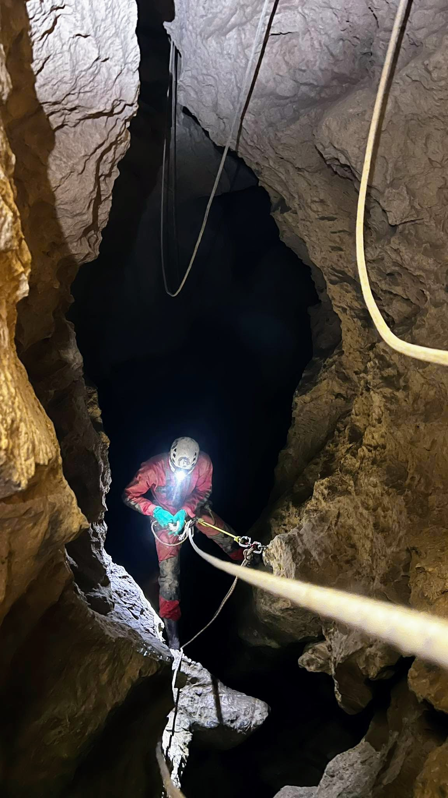
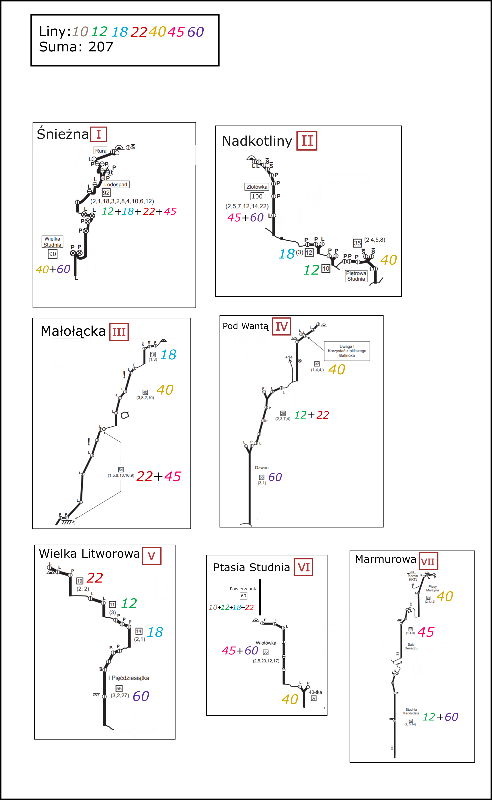

Łańcuchówka. 7 jaskiń, każda do głebokości mniej więcej -100.
 
 

 
 

---

Deniwelacja (743m)

1. Śnieżna - dno Wielkiej Studni (130m)

2. Nadkotliny - dno studni Piętrowej (125m)

3. Małołącka - do pułki przy -100 (100m)

4. Pod Wantą - dno Dzwonu (100m)

5. Litworowa - dno I Pięćdziesiątki (88m)

6. Ptasia Studnia - dno Czterdziestki (100m)

7. Marmurowa - dno studni Kandydata (100m)

 

---

Czasy:

1. Wyjście z bazy: 9:20

2. Snieżna: 12:00 - 13:30

3. Nadkotliny: 14:40 - 16:20

4. Małołącka: 16:35 - 18:15

5. Pod Wantą 19:00 - 20:30

6. Wielka Litworowa: 21:30 - 22:40

7. Ptasia Studnia: 23:50 - 1:20

8. Marmurowa: 3:00 - 4:40

9. Powrót na bazę: 7:20

 

---

Od wejścia do Śnieżnej do wyjścia z Marmurowej 16.5h. Od bazy do bazy 22h. 

Wszytkie jaskinie poręczowane, bez depozytów. 

Sprzęt wyniesiony do góry, 220m liny, 20 karabinków i 2 wory wrócił w całości na dół.

Na powierzchni wietrznie, pod ziemią stan wody określony na znośny.

Zachęcamy do powtórzeń.

 

---

Data akcji: 29.10.2023

Uczestnicy: Bartosz Ziarkowski, Ewa Woźniak

Poniżej zdjęcia i rozpiska lin:

<figure>

<figcaption align = "center"><b>Podejście, Wielka Polana Małołącka </b></figcaption>
</figure>
 
<figure>

<figcaption align = "center"><b>Przed wejściem do Śnieżnej </b></figcaption>
</figure>
 
<figure>

<figcaption align = "center"><b>Poręczowanie Wielkiej Studni </b></figcaption>
</figure>
 
<figure>

<figcaption align = "center"><b>Podejście w kierunku Nadkotlin </b></figcaption>
</figure>
 
<figure>

<figcaption align = "center"><b>Poręczowanie nad Studnią Piętrową </b></figcaption>
</figure>
 
<figure>

<figcaption align = "center"><b>Dzwon Pod Wantą </b></figcaption>
</figure>
 
<figure>

<figcaption align = "center"><b>Ptasia, przed Wlotówką </b></figcaption>
</figure>
 
<figure>

<figcaption align = "center"><b>Studnia Kandydata </b></figcaption>
</figure>
 
<figure>

<figcaption align = "center"><b>Zejście, rejon Pieca </b></figcaption>
</figure>
 
<figure>

<figcaption align = "center"><b>Rozpiska lin </b></figcaption>
</figure>
 

