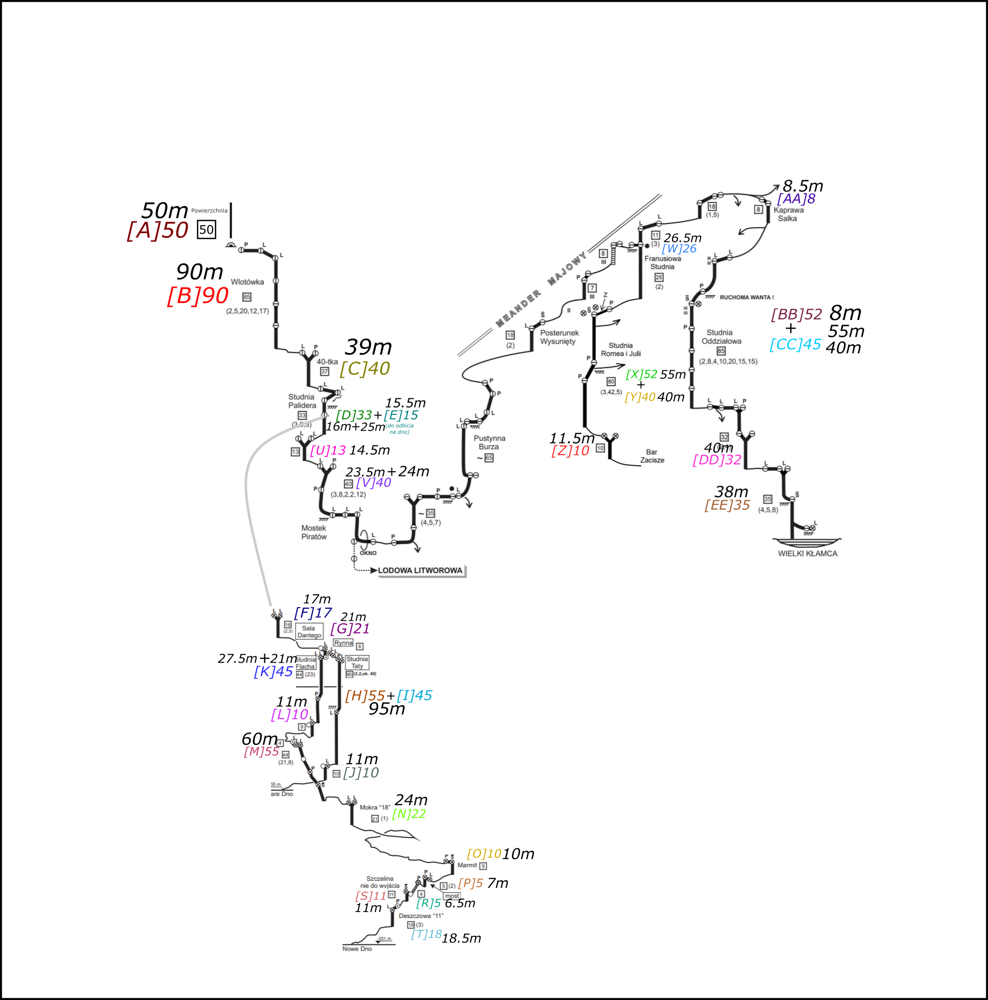

Tour de Ptasia (06-07 lipca 2024)
 
 
Celem było odwiedzenie czterech 'den' Ptasiej Studni w trakcie jednej akcji: Nowego Dna, Starego Dna, Baru "Zacisze" i Wielkiego Kłamcy.
 
 
Podzieliliśmy się na 4 zespoły (3 dwójkowe i 1 trójkowy). Każdy miał za zadanie zaporęczowanie jednego z den:
 
 
- Zespół 1.1 [Bartosz Ziarkowski, Piotr Wójcik] - Nowe Dno + główny ciąg
   
- Zespół 1.2 [Iwona Tucznio, Michał Duda] - Stare Dno
   
- Zespół 2.1 [Łukasz Wąchała, Szymon Musiał] - Bar "Zacisze"
   
- Zespół 2.2 [Danuta Gromała, Kamila Wachnicka, Ania Drzewicz] - Wielki Kłamca
   
 
Po zaporęczowaniu celem było odwiedzenie reszty den "na lekko" i 
zdeporęczowanie ostatniego z nich. Wyglądało to tak:
 
 
- Zespół 1.1 [Bartosz Ziarkowski, Piotr Wójcik] - Wielki Kłamca
   
- Zespół 1.2 [Iwona Tucznio, Michał Duda] - Bar "Zacisze"
   
- Zespół 2.1 [Łukasz Wąchała, Szymon Musiał] - Nowe Dno
   
- Zespół 2.2 [Danuta Gromała, Kamila Wachnicka, Ania Drzewicz] - Stare Dno + główny ciąg
   
 
Ostateczny czas akcji (od wejścia pierwszej osoby do wyjścia ostatniej) wyniósł 16.5h.
Użyliśmy 1000m lin i 90 karabinków. W jaskini pokonaliśmy około 780m przewyższeń.
 

<figure>
 

<figcaption align = "center"><b>Schemat działania</b></figcaption>
</figure>
 
 
 

<figure>
 

<figcaption align = "center"><b>Rozpiska lin</b></figcaption>
</figure>
 

