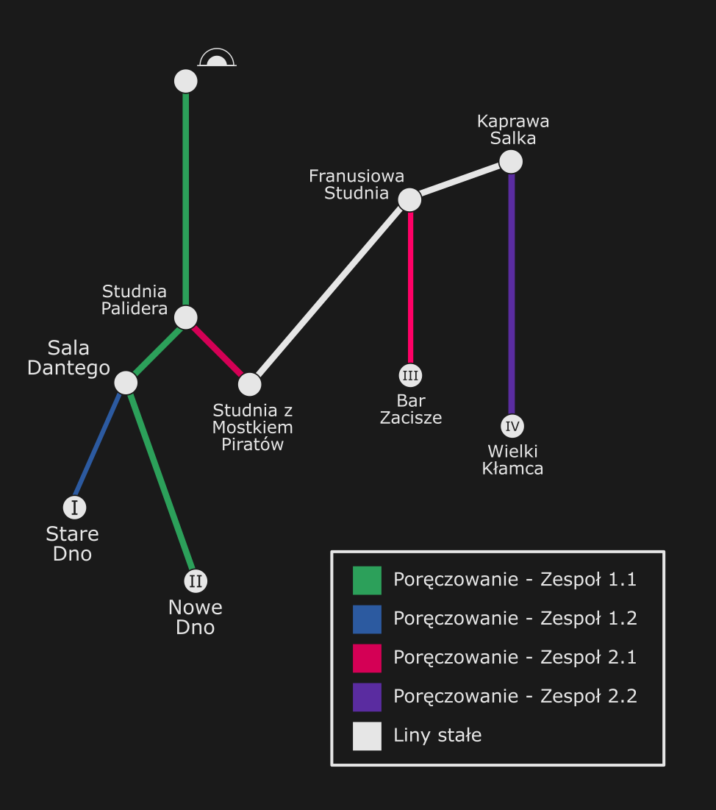
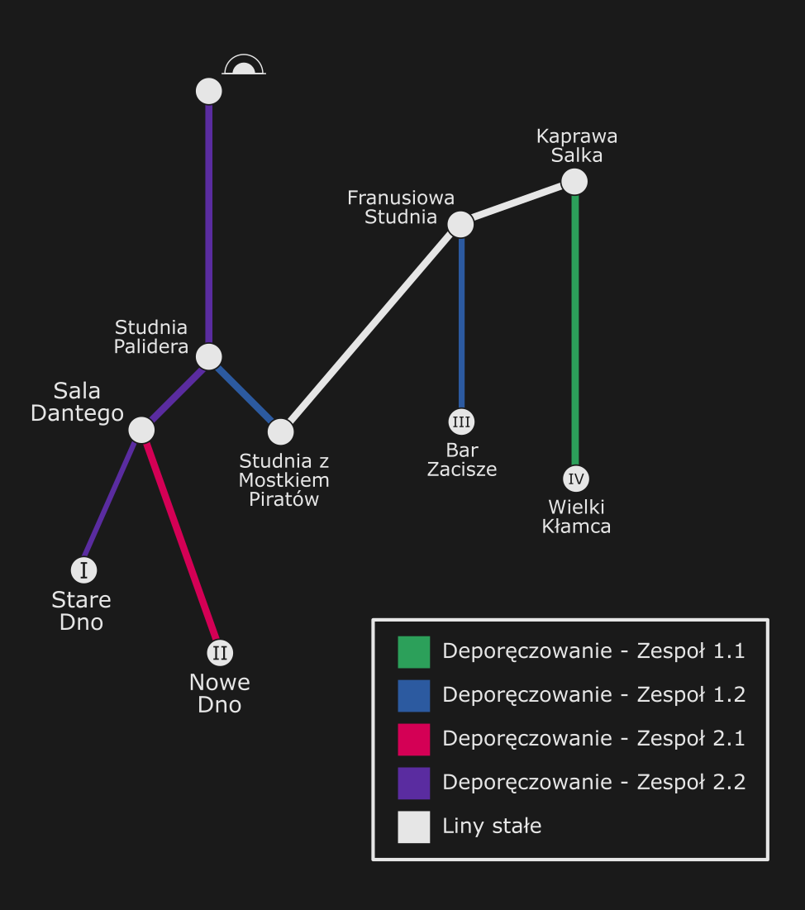

Tour de Ptasia (06.07.2024)

Celem było odwiedzenie czterech 'den' Ptasiej Studni w trakcie jednej akcji: Nowego Dna, Starego Dna, Baru "Zacisze" i Wielkiego Kłamcy.

Podzieliliśmy się na 4 zespoły (3 dwójkowe i 1 trójkowy). Każdy miał za zadanie zaporęczowanie jednego z den:

- Zespół 1.1 [Bartosz Ziarkowski, Piotr Wójcik] - Nowe Dno + główny ciąg

- Zespół 1.2 [Iwona Tucznio, Michał Duda] - Stare Dno

- Zespół 2.1 [Łukasz Wąchała, Szymon Musiał] - Bar "Zacisze"

- Zespół 2.2 [Danuta Gromała, Kamila Wachnicka, Ania Drzewicz] - Wielki Kłamca

Po zaporęczowaniu celem było odwiedzenie reszty den "na lekko" i zdeporęczowanie ostatniego odwiedzonego. Wyglądało to tak:

- Zespół 1.1 [Bartosz Ziarkowski, Piotr Wójcik] - Wielki Kłamca

- Zespół 1.2 [Iwona Tucznio, Michał Duda] - Bar "Zacisze"

- Zespół 2.1 [Łukasz Wąchała, Szymon Musiał] - Nowe Dno

- Zespół 2.2 [Danuta Gromała, Kamila Wachnicka, Ania Drzewicz] - Stare Dno + główny ciąg

Ostateczny czas akcji (od wejścia pierwszej osoby do wyjścia ostatniej) wyniósł około 16.5h. Użyliśmy około 1000m lin i 90 karabinków. W jaskini pokonaliśmy około 780m przewyższeń. 

<figure>
 

<figcaption align = "center"><b>Schemat działania</b></figcaption>
</figure>
 

